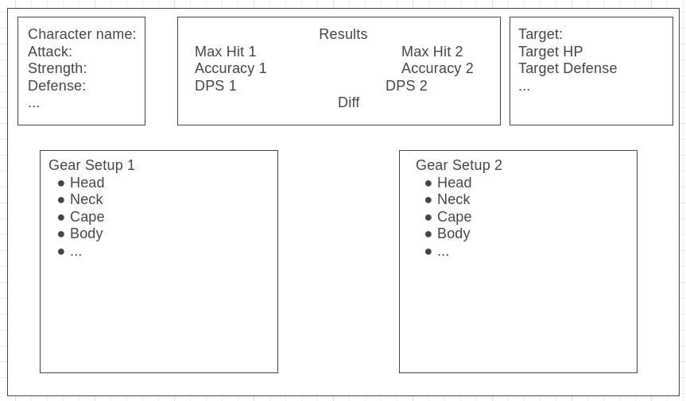

# Old School RuneScape Damage Calculator
A damage calculator for Old School RuneScape (OSRS). There are a handful of existing damage calculators online, but they all suffer from some key UX issue or another (no preset monsters, no user lookup, no way to save loadouts, *being straight up wrong*...), which I do not intend to replicate.

The front end will be built with React, and I would like to use Typescript instead of regular JS.

# Planning
## User Stories
As a user, I would like to:
- enter my OSRS character's stat lineup, or fetch it from the official OSRS servers
- select my gear loadout using a dropdown menu with autocomplete for each equipment slot
  - be able to input two loadouts simultaneously
- select any potions, passive buffs, etc. that I would like taken into account
- select the enemy that I am fighting, or enter its stats
- view the accuracy and DPS for both gear loadouts, as well as the percentage difference in their effectiveness
- manually enter stats for equipment, if desired
- create an account and log in
  - save and name gear loadouts to my account
  - save an OSRS character's stat lineup to my account
  - delete characters and loadouts at will
  - change my password or toggle a dark mode in a Settings page
  - log out

## Wireframes
Main page
